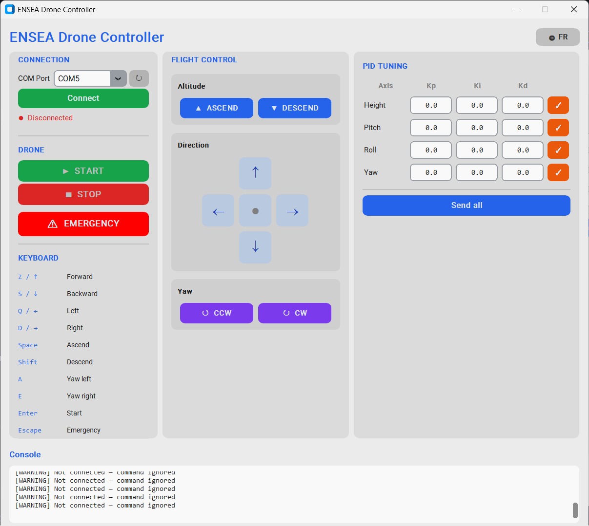

# ENSEA Drone Controller — Interface graphique PC

Interface de contrôle du drone ENSEA développée en Python/Tkinter.
Elle communique avec le drone via un **STM32 émetteur NRF24L01** connecté en USB.

---

## Prérequis

- Python 3.10+
- Bibliothèque `pyserial`

```bash
pip install -r requirements.txt
```

---

## Lancement

```bash
python main.py
```

---

## Architecture du code

```
.
├── main.py               # Point d'entrée
├── config.py             # Constantes (baudrate, palette, axes PID)
├── serial_comm.py        # Classe DroneSerial — communication UART
├── flight_commands.py    # Classe FlightCommands — construction des trames
├── requirements.txt
└── ui/
    ├── app.py            # Fenêtre principale — orchestre les panneaux
    ├── connection_panel.py  # Panneau gauche : connexion + boutons drone
    ├── control_panel.py     # Panneau centre : dpad, altitude, yaw
    ├── pid_panel.py         # Panneau droite : coefficients PID
    └── console_panel.py     # Bas de page : log série scrollable
```

---

## Protocole de communication

Le PC envoie des trames ASCII via UART (115 200 baud) au STM32 émetteur,
qui les retransmet au drone par radio NRF24L01+ (2,4 GHz, 250 kbps).

### Trames de vol — `$ABCDEFGH`

Trame de 9 caractères, chaque lettre vaut `'0'` ou `'1'` :

| Position | Action         |
|----------|----------------|
| `[1]`    | Monter         |
| `[2]`    | Descendre      |
| `[3]`    | Avant (pitch+) |
| `[4]`    | Arrière        |
| `[5]`    | Gauche (roll+) |
| `[6]`    | Droite         |
| `[7]`    | Yaw CCW        |
| `[8]`    | Yaw CW         |

Exemples :
```
$10000000   → monter
$00110000   → avant + gauche
$11111111   → arrêt d'urgence
```

### Commandes spéciales

| Trame    | Effet                           |
|----------|---------------------------------|
| `$start` | Initialisation + passage en vol |
| `$stop`  | Atterrissage / arrêt moteurs    |

### Modification PID — `*[axe][coeff][valeur]`

Format : `*` + axe (1 char) + coefficient (1 char) + valeur (6 chars)

| Axe | Description | Coeff | Description |
|-----|-------------|-------|-------------|
| `H` | Hauteur     | `P`   | Kp          |
| `P` | Pitch       | `I`   | Ki          |
| `R` | Roll        | `D`   | Kd          |
| `Y` | Yaw         |       |             |

Exemple : `*HP0.5000` → Kp Hauteur = 0.5

---

## Correspondance GUI ↔ STM32

Cette section montre, pour chaque action dans l'interface, la trame envoyée
et le code C du drone (`mainloop.c`) qui la traite.

---

### ▲ Bouton "Monter" (ou touche `Espace`)

**Python — `flight_commands.py`**
```python
# L'état UP=True construit la trame :
def build_frame(self) -> str:
    bits = ''.join('1' if k else '0' for k in self._keys)
    return f"${bits}"
# → envoie "$10000000\n" via UART
```

**STM32 — `mainloop.c`**
```c
// control_step() — exécuté toutes les 825 µs
if (validated_command[1]=='1' && validated_command[2]=='0') {
    height.command += height_step;          // consigne altitude +
    height.command = MIN(height.command, 1.5);
}
else if (validated_command[2]=='1' && validated_command[1]=='0') {
    height.command -= height_step;          // consigne altitude -
    height.command = MAX(height.command, 0);
}
```

---

### ↑ Bouton "Avant" (ou touche `Z`)

**Python** → envoie `$00100000`

**STM32 — `mainloop.c`**
```c
// Pitch command extraction
if (validated_command[3]=='1' && validated_command[4]=='0') {
    pitch.command = 1;       // inclinaison avant
}
else if (validated_command[4]=='1' && validated_command[3]=='0') {
    pitch.command = -1;      // inclinaison arrière
}
else {
    pitch.command = 0;       // pas de pitch
}
```

---

### ↺ Bouton "Yaw CCW" (ou touche `A`)

**Python** → envoie `$00000010`

**STM32 — `mainloop.c`**
```c
// Yaw command extraction
if (validated_command[7]=='1' && validated_command[8]=='0') {
    yaw.command += yaw_step;     // rotation gauche (CCW)
}
else if (validated_command[8]=='1' && validated_command[7]=='0') {
    yaw.command -= yaw_step;     // rotation droite (CW)
}
```

---

### ▶ Bouton "START" (ou touche `Entrée`)

**Python — `ui/app.py`**
```python
def _start_drone(self):
    self.drone.send("$start")    # → "$start\n" via UART
```

**STM32 — `mainloop.c`**
```c
// command_handler() — appelé à chaque réception NRF24L01
case IDLE_STATE:
    if (strcmp(received_command, "$start") == 0) {
        state = INITIALIZE_STATE;   // lance initialize()
    }
    break;

// initialize() démarre les timers, les capteurs, active le PID
// puis passe en FLYING_STATE si tout est OK
```

---

### ■ Bouton "STOP"

**Python** → envoie `$stop`

**STM32 — `mainloop.c`**
```c
case FLYING_STATE:
    if (strcmp(received_command, "$stop") == 0) {
        state = STOP_STATE;
    }
    break;

// stop() coupe les PWM moteurs et arrête tous les timers
void stop() {
    motor_SetPower(&MOTOR_FRONT_RIGHT, 0);
    motor_SetPower(&MOTOR_FRONT_LEFT,  0);
    motor_SetPower(&MOTOR_BACK_RIGHT,  0);
    motor_SetPower(&MOTOR_BACK_LEFT,   0);
    // ...
}
```

---

### ⚠ Bouton "URGENCE" (ou touche `Échap`)

**Python** → envoie `$11111111`

**STM32 — `mainloop.c`**
```c
// Dans control_step(), vérifié à chaque cycle :
if (strcmp(validated_command, "$11111111") == 0) {
    flight_allowed = 0;     // coupe les moteurs immédiatement
}

// Si flight_allowed == 0 :
motor_SetPower(&MOTOR_FRONT_RIGHT, 0);
motor_SetPower(&MOTOR_FRONT_LEFT,  0);
motor_SetPower(&MOTOR_BACK_RIGHT,  0);
motor_SetPower(&MOTOR_BACK_LEFT,   0);
```

---

### ✓ Bouton PID (ex: Kp Hauteur = 0.5)

**Python — `ui/app.py`**
```python
def _send_pid_coeff(self, axis, coeff, raw_str):
    val_str = f"{float(raw_str):.4f}"[:6].ljust(6, '0')
    self.drone.send(f"*{axis}{coeff}{val_str}")
# → envoie "*HP0.5000\n" via UART
```

**STM32 — `mainloop.c`**
```c
case COEFFICENT_MODIFICATION_STATE:
    // validated_command = "*HP0.5000"
    // [1] = axe : H → heightPID
    // [2] = coeff : P → kp
    // [3..8] = "0.5000" → atof

    char value_string[6];
    for (int i = 0; i < 6; i++)
        value_string[i] = validated_command[i + 3];

    float value = atof(value_string);   // = 0.5

    switch (validated_command[2]) {
        case 'P': modified_pid->kp = value; break;
        case 'I': modified_pid->ki = value; break;
        case 'D': modified_pid->kd = value; break;
    }
    state = IDLE_STATE;
```

---

## Contrôles clavier

| Touche      | Action           |
|-------------|------------------|
| `Z` / `↑`  | Avant            |
| `S` / `↓`  | Arrière          |
| `Q` / `←`  | Gauche           |
| `D` / `→`  | Droite           |
| `Espace`    | Monter           |
| `Shift`     | Descendre        |
| `A`         | Yaw gauche (CCW) |
| `E`         | Yaw droit (CW)   |
| `Entrée`    | Start drone      |
| `Échap`     | Arrêt d'urgence  |

---

## Configuration série

| Paramètre | Valeur  |
|-----------|---------|
| Baud rate | 115 200 |
| Data bits | 8       |
| Stop bits | 1       |
| Parité    | Aucune  |
| Fréquence | 20 Hz   |